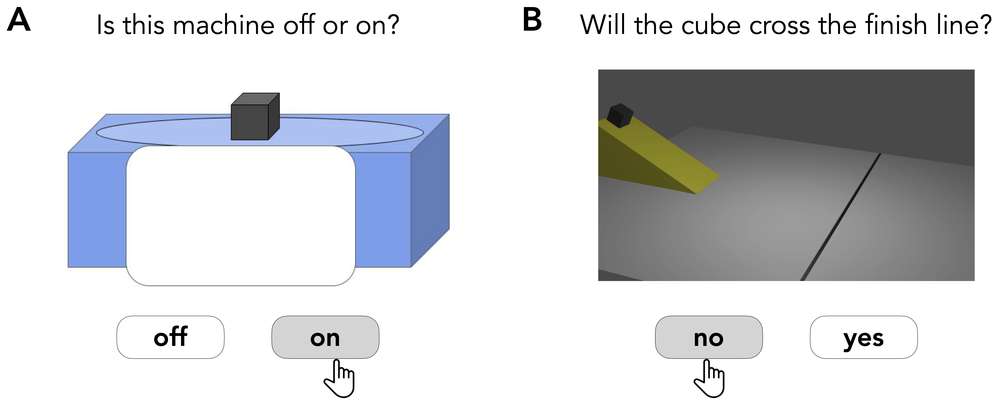

# Learning what matters: Causal abstraction in human inference

This repository contains the experiments, data, analyses, and figures for the paper "Learning what matters: Causal abstraction in human inference" by Steven Shin (Steven.M.Shin.23@dartmouth.edu) and Tobias Gerstenberg (gerstenberg@stanford.edu).

## Abstract

What shape do people's mental models take? We hypothesize that people build causal models that are suited to the task at hand. These models abstract away information to represent what matters. To test this idea empirically, we presented participants with causal learning paradigms where some features were outcome-relevant and others weren't. In Experiment 1, participants had to learn what objects of different shape and color made a machine turn on. In Experiment 2, they had to predict whether blocks sliding down ramps would cross a finish line. In both experiments, participants made systematic errors in a surprise test that asked them to recall what they had seen earlier. The errors people made suggest that they had built mental models of the task that privileged causally relevant information. Our results contribute to recent efforts trying to characterize the important role that causal abstraction plays in human learning and inference.



## Repo structure

```
.
├── code
│   ├── R
│   ├── blender
│   └── experiments
├── data
│   ├── experiment1
│   ├── experiment2
│   ├── experiment3
│   ├── experiment4
│   ├── experiment5
│   ├── experiment6
│   └── experiment7
├── docs
│   ├── analysis
│   └── experiments
├── figures
│   ├── diagrams
│   ├── plots
│   └── stimuli
└── videos
    └── physics
```

### code

#### R

- analysis scripts 
- you can see the rendered analysis script [here](https://cicl-stanford.github.io/abstract_causation/experiments/analysis/)

#### blender

- blender files for creating the physical animations in Experiment 2 

#### experiments

- all experiments were programmed with [jsPsych](https://www.jspsych.org/7.3/)
- you can see a demo of Experiment 1 (blickets) [here](https://cicl-stanford.github.io/abstract_causation/experiments/blicket/), and one for Experiment 2 (physics) [here](https://cicl-stanford.github.io/abstract_causation/experiments/physics/)
- read the `experiment-readme.md` for a brief description of each experiment 

### data

- data files 

### figures

- diagrams, plots, and stimuli 

### videos

- two example video clips from the physics experiment 

